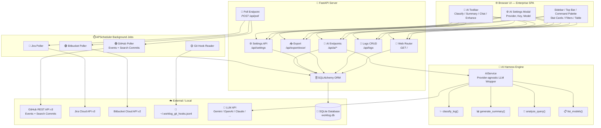
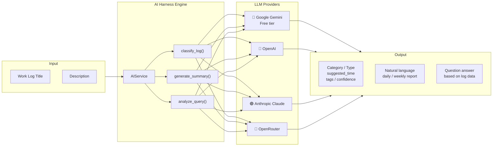

<div align="center">

# 🤖 Work Log Harness

**AI-Powered Work Log Collector & Analyzer**  
*Tự động thu thập, phân loại, và báo cáo thời gian làm việc từ GitHub, Jira, Bitbucket, Git, và Manual Entry*

[](https://python.org)
[](https://fastapi.tiangolo.com)
[](https://sqlite.org)
[](https://getbootstrap.com)
[](LICENSE)

</div>

---

## 📋 Mục lục

- [Tổng quan](#-tổng-quan)
- [Screenshots](#-screenshots)
- [Tính năng](#-tính-năng)
- [Kiến trúc](#-kiến-trúc)
  - [System Architecture](#-system-architecture)
  - [Harness Engine (AI Core)](#-harness-engine-ai-core)
  - [Công nghệ sử dụng](#-công-nghệ-sử-dụng)
  - [Cấu trúc thư mục](#-cấu-trúc-thư-mục)
  - [Database Model](#-database-model)
- [Cài đặt & Chạy](#-cài-đặt--chạy)
- [Cấu hình AI Harness](#-cấu-hình-ai-harness)
- [Hướng dẫn sử dụng](#-hướng-dẫn-sử-dụng)
  - [Dashboard Overview](#-dashboard-overview)
  - [Sidebar Navigation](#-sidebar-navigation)
  - [Command Palette](#-command-palette)
  - [Dark Mode](#-dark-mode)
  - [Manual Entry](#-manual-entry)
  - [Bảng Work Logs](#-bảng-work-logs)
  - [Export Excel](#-export-excel)
  - [AI Auto-Classify](#-ai-auto-classify)
  - [AI Generate Summary](#-ai-generate-summary)
  - [AI Chat](#-ai-chat)
  - [Poll Now](#-poll-now)
- [Tích hợp GitHub](#-tích-hợp-github)
- [Tích hợp Jira](#-tích-hợp-jira)
- [Tích hợp Bitbucket](#-tích-hợp-bitbucket)
- [Tích hợp Git Hooks](#-tích-hợp-git-hooks)
- [API Reference](#-api-reference)
- [Keyboard Shortcuts](#-keyboard-shortcuts)
- [Giấy phép](#-giấy-phép)

---

## 🎯 Tổng quan

**Work Log Harness** là một AI-powered enterprise dashboard giúp bạn tự động ghi nhận, phân loại, phân tích thời gian làm việc từ nhiều nguồn. Với giao diện premium SaaS và LLM engine tích hợp sẵn, công cụ biến việc timesheet thành trải nghiệm liền mạch.

| Nguồn | Cơ chế | Dữ liệu thu thập |
|-------|--------|------------------|
| **GitHub** | Polling REST API (Events + Search Commits) | Commits, push activities |
| **Jira** | Polling REST API | Ticket update, comment, estimation change, status change |
| **Bitbucket** | Polling REST API | Commit, pull request |
| **Git** | Post-commit hook | Local commit (message, files, timestamp) |
| **Manual** | Web form UI | Meeting, code review, research, other |
| **🤖 AI Engine** | LLM (Gemini/OpenAI/Claude/...) | Classify, summarize, natural language query |

---

## 🖼️ Screenshots

| Dashboard | Dark Mode |
|-----------|-----------|
| Premium stat cards, enterprise table, AI Harness panel | Full dark theme with sidebar |

| Command Palette | AI Features |
|-----------------|-------------|
| ⌘K quick actions palette | Auto-classify, summary, chat |

---

## ✨ Tính năng

### UI/UX — Enterprise SaaS Design
- **🎨 Premium Dashboard** — Thiết kế lấy cảm hứng từ Stripe/Linear/Vercel
- **🌙 Dark Mode** — Theme toggle với localStorage persistence
- **⌨️ Command Palette** — ⌘K quick search & actions
- **📊 Stat Cards** — 9-card grid với animated counters, sparklines, trend badges
- **🔍 Command Filter Toolbar** — Search, source/type/date filters với live search
- **📋 Enterprise Table** — Sticky headers, alternating rows, dropdown action menus
- **⚡ Skeleton Loading** — Shimmer animation khi load data
- **🔔 Toast Notifications** — Premium slide-in notifications với color-coded types
- **📱 Responsive** — Tối ưu từ desktop 1400px+ đến mobile 480px

### Thu thập dữ liệu
- **🔄 Auto-collect GitHub** — Events API + Search Commits API (dual fallback)
- **🔄 Auto-collect Jira** — Poll API, detect issue update, comment, estimation, status change
- **🔄 Auto-collect Bitbucket** — Commit mới, PR activities
- **📝 Local Git Tracking** — Post-commit hook ghi mỗi lần commit
- **➕ Manual Entry** — Form nhập tay cho meeting, code review, research
- **⏱️ Poll Now** — Manual trigger để poll ngay lập tức

### AI Harness Engine
- **✨ Auto-Classify** — LLM tự động phân loại activity type, gợi ý thời gian, gắn tags
- **📊 Generate Summary** — Báo cáo bằng natural language theo date range
- **💬 Ask AI** — Hỏi về work logs bằng tiếng Việt/English (vd: *"Hôm qua tôi làm gì?"*)
- **⚙️ Runtime Config** — Nhập host/key/model trực tiếp từ UI, không cần sửa .env

### UI & Export
- **📥 Export Excel** — File .xlsx với 2 sheets (chi tiết + summary), màu theo source
- **📈 Dashboard Stats** — Tổng logs, tổng thời gian, hôm nay, tuần này, breakdown theo nguồn

---

## 🏗 Kiến trúc

### 🔧 System Architecture



### 🤖 Harness Engine (AI Core)



### Công nghệ sử dụng

| Layer | Công nghệ | Mục đích |
|-------|-----------|----------|
| **Backend** | Python 3.12+ | Core logic |
| **Web framework** | FastAPI 0.115 | REST API + lifespan events |
| **ASGI server** | Uvicorn 0.34 | Serve app |
| **ORM** | SQLAlchemy 2.0 | Database |
| **Database** | SQLite | Zero-config storage |
| **Scheduler** | APScheduler 3.10 | Background polling jobs |
| **HTTP client** | httpx 0.28 | GitHub, Jira, Bitbucket & LLM API calls |
| **Excel export** | openpyxl 3.1 | .xlsx với styling |
| **AI Engine** | Provider-agnostic | Gemini / OpenAI / Claude / OpenRouter / DeepSeek |
| **Frontend** | Vanilla JS + CSS | Premium SPA, fetch API, modals |
| **UI Framework** | Bootstrap 5.3.3 | Modals, dropdowns, pagination |
| **Typography** | Inter (Google Fonts) | Design system font |
| **Icons** | Bootstrap Icons | Icon library |

### Cấu trúc thư mục

```
tool-auto-logwork/
├── app.py                      # Entry point — FastAPI app
├── config.py                   # Env config (server, DB, GitHub, Jira, Bitbucket)
├── requirements.txt
├── .env.example
├── .gitignore
├── README.md
│
├── database/
│   ├── db.py                   # SQLAlchemy engine, SessionLocal, init_db()
│   └── models.py               # WorkLog + AppSetting models
│
├── services/
│   └── ai_service.py           # 🤖 AI Harness Core — provider-agnostic LLM wrapper
│                                #   • classify_log()    — phân loại work entry
│                                #   • generate_summary()— tóm tắt logs
│                                #   • analyze_query()   — chat với work logs
│                                #   • list_models()     — fetch models từ API
│
├── pollers/
│   ├── scheduler.py            # APScheduler — lifecycle (immediate startup)
│   ├── github.py               # 🟣 GitHub Poller — Events + Search Commits
│   ├── jira.py                 # 🔵 Jira Cloud REST API v3 poller
│   ├── bitbucket.py            # 🟢 Bitbucket Cloud REST API v2 poller
│   └── git_hook_reader.py      # Đọc ~/.worklog_git_hooks.jsonl
│
├── routers/
│   ├── web.py                  # GET / → render index.html
│   ├── logs.py                 # CRUD: /api/logs
│   ├── export.py               # Export: /api/export/excel
│   ├── settings.py             # ⚙️ Settings: /api/settings
│   ├── ai.py                   # 🤖 AI: /api/ai/classify, /summarize, /analyze
│   └── poll.py                 # 🔄 Poll Now: POST /api/poll
│
├── templates/
│   └── index.html              # Enterprise SPA — sidebar, top bar, stats, table, AI panels
│
├── static/
│   ├── style.css               # Premium design system (~650 lines, light/dark theme)
│   └── script.js               # JS — sidebar, theme, cmd palette, AI, table, poll
│
└── hooks/
    ├── setup.sh                # Cài git hooks
    └── post-commit             # Post-commit hook
```

### Database Model

**`work_logs`** table:

| Column | Type | Mô tả |
|--------|------|-------|
| `id` | INTEGER (PK) | Auto-increment |
| `source` | VARCHAR(20) | `github`, `jira`, `bitbucket`, `git`, `manual` |
| `activity_type` | VARCHAR(50) | `commit`, `ticket_update`, `comment`, `meeting`, ... |
| `title` | VARCHAR(500) | Tiêu đề ngắn gọn |
| `description` | TEXT | Mô tả chi tiết |
| `project` | VARCHAR(100) | Project key / repo name |
| `url` | VARCHAR(1000) | Link đến ticket / PR / commit |
| `activity_timestamp` | DATETIME | Thời điểm hoạt động |
| `time_spent_minutes` | INTEGER | Thời gian (phút) |
| `external_id` | VARCHAR(200) | ID bên ngoài (commit hash, issue key) |
| `metadata_json` | TEXT | Extra data JSON |
| `created_at` | DATETIME | Thời điểm log được tạo |

**`app_settings`** table (key-value):

| Column | Type | Mô tả |
|--------|------|-------|
| `key` | VARCHAR(100) PK | `ai_enabled`, `ai_provider`, `ai_api_key`, ... |
| `value` | TEXT | Giá trị |
| `updated_at` | DATETIME | Thời điểm cập nhật |

---

## 🚀 Cài đặt & Chạy

### Yêu cầu

- **Python 3.12+**

### Quick start

```bash
cd tool-auto-logwork
python3 -m pip install -r requirements.txt
cp .env.example .env
python app.py
```

### Các cách cài dependencies khác

Nếu `python3 -m pip` không phù hợp, bạn có thể dùng một trong các cách sau:

| Cách | Lệnh | Ghi chú |
|------|------|---------|
| **pip** (Python built-in) | `pip install -r requirements.txt` | macOS có thể không có `pip`, dùng `python3 -m pip` hoặc `pip3` |
| **pip3** | `pip3 install -r requirements.txt` | Tương tự pip, dành cho Python 3 |
| **uv** (nhanh hơn 10-100x) | `uv pip install -r requirements.txt` | Cài uv: `curl -LsSf https://astral.sh/uv/install.sh \| sh` |
| **pipenv** | `pipenv install` | Tự động tạo virtualenv |
| **poetry** | `poetry install` | Nếu có sẵn `pyproject.toml` |
| **Conda** | `conda install --file requirements.txt` | Nếu dùng Anaconda / Miniconda |
| **Virtual env** (khuyên dùng) | `python3 -m venv .venv && source .venv/bin/activate && pip install -r requirements.txt` | Cô lập dependencies, tránh xung đột |

Mở **[http://localhost:8765](http://localhost:8765)**

Bạn sẽ thấy:
```
🚀 Starting server at http://127.0.0.1:8765

📦 Initializing database...
  ✓ Database ready

⏱  Starting pollers...
  – Jira poller disabled (config missing)
  – Bitbucket poller disabled (config missing)
  ✓ GitHub poller enabled — every 5 min
  ✓ Git hook reader enabled — every 2 min
  ✓ Scheduler started
```

> 🟢 App đã sẵn sàng! Chưa cần config Jira/Bitbucket — bạn có thể dùng **Manual Entry** + **AI Harness** ngay.

---

## ⚙️ Cấu hình AI Harness

Tất cả cấu hình AI được thực hiện **trực tiếp từ giao diện web**, không cần sửa `.env`.

### Các bước

```
  1. Mở app → Click ⚙️ ở top bar hoặc sidebar → Settings
  2. Chọn provider (khuyên dùng: Gemini — có free tier)
  3. Dán API Key
  4. Click "🔌 Test Connection & Load Models"
  5. Chọn model từ dropdown (tự động load từ API)
  6. Click "💾 Save Settings"
```

### Các provider hỗ trợ

| Provider | Base URL | Key lấy ở đâu |
|----------|----------|---------------|
| **Google Gemini** | `https://generativelanguage.googleapis.com/v1beta/openai/` | [aistudio.google.com/apikey](https://aistudio.google.com/apikey) — free |
| **OpenAI** | `https://api.openai.com/v1` | [platform.openai.com/api-keys](https://platform.openai.com/api-keys) |
| **Anthropic Claude** | `https://api.anthropic.com/v1` | [console.anthropic.com](https://console.anthropic.com) |
| **OpenRouter** | `https://openrouter.ai/api/v1` | [openrouter.ai/keys](https://openrouter.ai/keys) |
| **DeepSeek** | `https://api.deepseek.com` | [platform.deepseek.com](https://platform.deepseek.com) |

### Flow Test Connection → Load Models

```
Enter API Key
      │
      ▼
[🔌 Test Connection & Load Models]
      │
      ├── ❌ Key sai / Network error
      │       → báo lỗi, giữ text input để gỡ lỗi
      │
      └── ✅ Key đúng
              → gửi test message → nhận response "OK"
              → fetch GET /v1/models → danh sách models
              → chuyển text input → <select> dropdown
              → auto-chọn model phù hợp nhất
              → hiển thị số lượng models đã load
```

---

## 📖 Hướng dẫn sử dụng

### 🔹 Dashboard Overview

Dashboard được thiết kế theo chuẩn enterprise SaaS (Stripe/Linear/Vercel inspired):

| Khu vực | Mô tả |
|---------|-------|
| **Sidebar** (trái) | 72px icon rail, expandable nav (256px), user profile |
| **Top Bar** (trên) | Breadcrumb, command palette (⌘K), AI status, theme toggle, sync, settings, avatar |
| **Dashboard Hero** | Tiêu đề trang + action buttons (Sync, Export, Add Entry) |
| **Stat Cards** | 9-card grid: Total Logs, Total Time, Today, This Week, breakdown theo source |
| **Filter Toolbar** | Search, source picker, type picker, date range, reset |
| **AI Harness Panel** | Auto-classify, auto-enhance, summary, chat, API link |
| **Enterprise Table** | Work logs với dropdown action menus, sticky headers |

### 🔹 Sidebar Navigation

- **Desktop**: Sidebar ở chế độ icon rail (72px) mặc định
  - Click vào sidebar edge / hamburger → expand (256px) với labels
  - Các nav items: Dashboard, Add Entry, Refresh
  - Source quick filters: GitHub, Jira, Bitbucket, Manual
  - Tools: AI Harness, Settings
- **Mobile**: Sidebar là off-canvas overlay
  - Click hamburger icon (☰) ở top bar → slide-in từ trái
  - Click overlay mờ → đóng sidebar

### 🔹 Command Palette

- **Mở**: Click vào search bar ở top bar, hoặc nhấn **⌘+K** (Mac) / **Ctrl+K** (Windows/Linux)
- **Các action**:
  - `Search work logs` — focus vào filter search
  - `Add manual entry` — mở modal tạo entry mới
  - `Open settings` — mở AI settings modal
  - `Sync all sources` — trigger poll ngay lập tức
  - `Export to Excel` — download Excel file
  - `Toggle dark mode` — chuyển đổi theme
- **Live search**: Gõ để filter danh sách command
- **Enter**: Chạy command đang được highlight

### 🔹 Dark Mode

- Click 🌙/☀️ icon ở top bar → toggle light/dark
- Trạng thái được lưu trong `localStorage`, persist qua các lần reload
- Full theme system với CSS custom properties:
  - Màu nền, card, text, border được chuyển sang dark palette
  - Gradient và shadow được tối ưu cho dark mode
  - Shimmer animation dùng overlay light thay vì white

### 🔹 Manual Entry

1. Click **➕ Add Entry** ở dashboard hero, hoặc dùng **⌘+N**
2. Điền form: Title, Description, Activity Type, Project, Date, Time
3. Click **💾 Save**
- Hoặc double-click vào bảng → modal edit

### 🔹 Bảng Work Logs

- **Filter**: Source, Type, Date range — click dropdown/date picker
- **Search**: Gõ vào ô search (300ms debounce) — tìm title / description / project
- **Sort**: Click header column (toggles asc/desc), arrow icon chỉ hướng sort
- **Phân trang**: 50 entries/trang, pagination controls ở cuối bảng
- **Actions menu**: Click ⋮ ở mỗi dòng → dropdown với Edit, Delete, Classify, Enhance
- **Refresh**: Click Sync ở hero, hoặc Refresh ở table header, hoặc **⌘⇧R**

### 🔹 Export Excel

- **📥 Export** ở dashboard hero — toàn bộ dữ liệu
- Hoặc dùng **⌘+E**
- File gồm 2 sheets: **Work Logs** (chi tiết, màu theo source) + **Summary** (thống kê)

### 🔹 AI Auto-Classify

Khi AI Harness được bật, mỗi dòng trong bảng có **Classify** trong dropdown menu:
- Click ✨ / Classify → LLM phân tích title + description
- Tự động gợi ý: **activity type**, **thời gian ước lượng**, **tags**
- Nếu confidence > 50% → tự động áp dụng vào database
- **✨ Auto-Classify** (batch) — xử lý tất cả manual entries chưa phân loại

**Ví dụ:**
```
Title: "Fix login bug PROJ-456"
Description: "Debugging authentication issue with OAuth token refresh"
  → category: "coding"
  → suggested_time: 90 minutes
  → tags: ["bug-fix", "authentication", "oauth"]
  → confidence: 0.92
```

### 🔹 AI Generate Summary

1. Click **📊 Generate Summary** trong AI Harness panel
2. Chọn date range (From → To)
3. Click **✨ Generate**
4. LLM tạo báo cáo bằng natural language:
   - Key accomplishments
   - Time breakdown by category
   - Notable patterns & suggestions

### 🔹 AI Chat

1. Click **💬 Ask AI** trong AI Harness panel
2. Gõ câu hỏi bằng tiếng Việt hoặc English
3. LLM trả lời dựa trên dữ liệu work logs

**Ví dụ câu hỏi:**
- *"Hôm qua tôi làm gì?"*
- *"How many hours did I spend on meetings this week?"*
- *"Tôi dành bao nhiêu thời gian cho PROJ-123?"*
- *"What's my most common activity type?"*

### 🔹 Poll Now

- **Sync** button ở dashboard hero → trigger poll tất cả sources ngay lập tức
- Hoặc **Sync** button ở table header
- Hoặc **⌘+⇧+R** (Command Palette)
- API trả về kết quả từng poller dạng toast notification

---

## 🔌 Tích hợp GitHub

### Cấu hình (.env)

```ini
GITHUB_TOKEN=ghp_your-personal-access-token
GITHUB_POLL_INTERVAL_MINUTES=5
```

**Tạo Token:** GitHub → Settings → Developer settings → Personal access tokens → Fine-grained tokens (permissions: `Events: Read`, `Commits: Read`)

### Cách hoạt động

Poll REST API v3 mỗi N phút với dual strategy:

1. **Events API** (`/users/{username}/events?per_page=100`) — lấy tất cả events gần đây
2. **Search Commits API** (`/search/commits?author={username}&committer-date>{since}`) — fallback khi events không đủ

Dedup bằng `external_id = f"github_commit_{sha}"` giúp không trùng lặp dữ liệu.

---

## 🔌 Tích hợp Jira

### Cấu hình (.env)

```ini
JIRA_URL=https://your-domain.atlassian.net
JIRA_EMAIL=your-email@example.com
JIRA_API_TOKEN=your-token
JIRA_PROJECT=PROJ
JIRA_POLL_INTERVAL_MINUTES=10
```

**Tạo API Token:** https://id.atlassian.com/manage/api-tokens

### Cách hoạt động

Poll REST API v3 mỗi N phút:
1. JQL: `assignee=currentUser() AND updated>='{last_poll}'`
2. Phân tích changelog: status change, estimation change
3. Fetch comments riêng
4. Ghi DB (dedup bằng external_id)

### Dữ liệu thu thập

| Activity Type | Mô tả |
|---------------|-------|
| `status_change` | Issue chuyển trạng thái |
| `estimation_change` | Thay đổi time estimate |
| `comment` | Comment mới |

---

## 🔌 Tích hợp Bitbucket

### Cấu hình (.env)

```ini
BITBUCKET_USERNAME=your-username
BITBUCKET_APP_PASSWORD=your-password
BITBUCKET_WORKSPACE=your-workspace
BITBUCKET_POLL_INTERVAL_MINUTES=10
```

**Tạo App Password:** Settings → App passwords → Create (permissions: Account Read, Repositories Read, Pull Requests Read)

### Cách hoạt động

Poll REST API v2 mỗi N phút:
1. Lấy repositories trong workspace
2. Lấy commits gần đây (filter theo user)
3. Lấy pull requests (OPEN + MERGED)
4. Ghi DB

### Dữ liệu thu thập

| Activity Type | Mô tả |
|---------------|-------|
| `commit` | Commit mới |
| `pr_create` / `pr_merge` | Pull Request activities |

---

## 🔌 Tích hợp Git Hooks

### Cài đặt

```bash
# Cho một repo
cd /path/to/your/project
bash /path/to/tool-auto-logwork/hooks/setup.sh

# Global (tất cả repo)
bash /path/to/tool-auto-logwork/hooks/setup.sh --global
```

Mỗi lần commit → ghi JSON vào `~/.worklog_git_hooks.jsonl` → app đọc mỗi 2 phút.

---

## 📡 API Reference

### Work Logs

| Method | Endpoint | Mô tả |
|--------|----------|-------|
| `GET` | `/api/logs` | Danh sách (filter, sort, paginate) |
| `GET` | `/api/logs/stats` | Thống kê |
| `POST` | `/api/logs` | Tạo manual entry |
| `PATCH` | `/api/logs/{id}` | Cập nhật |
| `DELETE` | `/api/logs/{id}` | Xoá |

### Polling 🔄

| Method | Endpoint | Mô tả |
|--------|----------|-------|
| `POST` | `/api/poll` | Trigger poll tất cả sources ngay lập tức |

### Settings ⚙️

| Method | Endpoint | Mô tả |
|--------|----------|-------|
| `GET` | `/api/settings` | Lấy settings (key masked) |
| `PUT` | `/api/settings` | Cập nhật settings `[{key, value}]` |
| `POST` | `/api/settings/test` | Test kết nối + load models |

**`POST /api/settings/test`:**
```json
// Request
{ "provider": "gemini", "api_key": "...", "base_url": "...", "model": "..." }

// Response (success)
{
  "status": "success",
  "response": "OK",
  "models": [
    {"id": "gemini-2.0-flash", "owned_by": "google"},
    {"id": "gemini-2.5-pro", "owned_by": "google"},
    ...
  ],
  "suggested_model": "gemini-2.0-flash"
}

// Response (error)
{ "status": "error", "message": "HTTP 400: Invalid API key" }
```

### AI Endpoints 🤖

| Method | Endpoint | Mô tả |
|--------|----------|-------|
| `POST` | `/api/ai/classify/{id}` | Classify 1 log |
| `POST` | `/api/ai/classify` | Batch classify (mặc định: manual entries) |
| `POST` | `/api/ai/summarize` | Generate summary (date range) |
| `POST` | `/api/ai/analyze` | Chat với work logs |

### Export 📥

| Method | Endpoint | Mô tả |
|--------|----------|-------|
| `GET` | `/api/export/excel` | Export toàn bộ |
| `GET` | `/api/export/excel/{source}` | Export theo nguồn |

---

## ⌨️ Keyboard Shortcuts

| Shortcut | Action |
|----------|--------|
| **⌘K** / **Ctrl+K** | Mở Command Palette |
| **⌘N** / **Ctrl+N** | Tạo manual entry mới |
| **⌘E** / **Ctrl+E** | Export Excel |
| **⌘,** / **Ctrl+,** | Mở Settings |
| **Esc** | Đóng Command Palette |
| **⌘⇧R** / **Ctrl+Shift+R** | Sync all sources (Poll Now) |
| **⌘⌥D** / **Ctrl+Alt+D** | Toggle dark mode (trong command palette) |

---

## 📄 Giấy phép

MIT License — bạn có thể tự do sử dụng, sửa đổi và phân phối.

---

<div align="center">
<i>Built with ❤️ for developers who hate manual timesheets</i>
</div>
